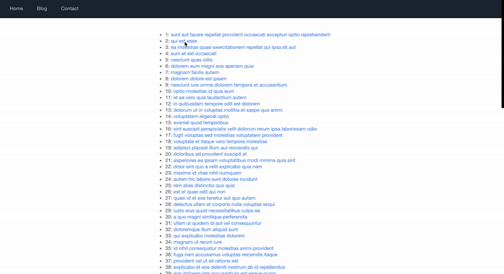

# tutorial-next-hp

Next.js と JSONPlaceholder (GraphQL ver) を使用した、記事一覧 Web アプリケーション。



## for developer

### develop

```zsh
# pre
git clone https://github.com/kuro-kuroite/tutorial-next-hp.git
cd tutorial-next-hp
yarn install

# develop
npm run dev # open http://localhost:3000

# build and start
npm run build && npm run start # open http://localhost:3000
```

### deploy

```zsh
# pre
# git add .
# git commit

# deploy
git push origin main # vercel can detect pushing main and deploy it
```

## GraphQL

### fetch schema

```zsh
npx get-graphql-schema https://json-placeholder-graphql.herokuapp.com/graphql > types/api/jsonPlaceHolder.graphql
```

### generate schema

```zsh
# pre
# yarn add @apollo/client graphql
# yarn add -D @graphql-codegen/cli
# npx graphql-codegen init
# yarn install

npm run update:codegen
```
